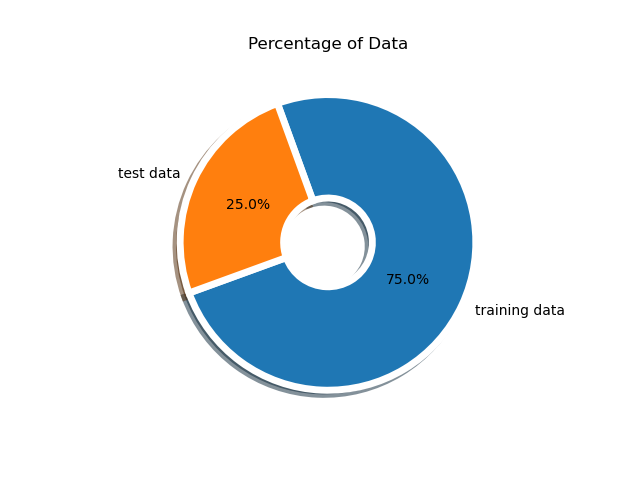

# Reference, source
	[Drug recommendation using review in Kaggle](https://www.kaggle.com/bhuemims/recommendation-medicines-by-using-a-review)

# Data Analysis
	

	
> 전체 데이터 구성은 uniqueID를 가진 환자가 가지고 있는 증상에 필요한 약을 구입한 뒤에 특정 날짜에 review와 rating을 남김. 그리고 다른 환자가 해당 리뷰를 보고 도움이 되었는지에 대해 usefulCount attribute에 점수(1점 추가)를 줌

## 1. Training data는 161297개, Test data는 53766개

## 2. Attribute는 uniqueID를 포함해서 training data와 test data 모두 7개가 있음

| uniqueID | drugName | condition | review | rating | date | usefulCount |
| -------- | -------- | --------- | ------ | ------ | ---- | ----------- |
| identify individual data | name of drug | name of condition | patient review | 10 star patient rating | date of review entry | number of users who found review useful |

'''python
training data 에서 attribute :  Index(['uniqueID', 'drugName', 'condition', 'review', 'rating', 'date',
       'usefulCount'],
      dtype='object')
	  
test data 에서 attribute :  Index(['uniqueID', 'drugName', 'condition', 'review', 'rating', 'date',
       'usefulCount'],
      dtype='object')
'''

    1. uniqueID
	
	
		한명의 고객이 중복해서 여러 리뷰를 작성했는지 검사

		'''python
		df_all = pd.concat([df_train, df_test]).reset_index()
		del df_all['index']

		uniqueValue = df_all.shape[0]
		print("uniqueID를 기준으로 중복된 데이터 있는지 확인 : ", uniqueValue)
		print("set 메서드를 이용해서 중복 개수 확인 : ", len(set(df_all['uniqueID'].values)))
		'''
		
		'''python
		uniqueID를 기준으로 중복된 데이터 있는지 확인 :  215063
		
		set 메서드를 이용해서 중복 개수 확인 :  215063
		
		'''

		전체 215063개의 데이터에 대해 각각 161297개의 training data와 53766개의 test data에 대해 중복된 uniqueID는 없음을 확인
		

	2. condition and drugName

		증상과 약품명은 서로 관련이 깊음.
		
		'''python
		
		The number of unique condition is  917
		
		The number of unique drugName is  3671
		
		'''
		
		증상의 경우, condition 열에서 unique하게 3671개가 있음
		약품명의 경우, drugName 열에서 unique하게 917개가 있음

		데이터를 수집하는 과정중에서 condition항목에 '3 users found this comment helpful.'이라는 에러  데이터가 들어가 있음. (4...도 마찬가지)
		
		condition의 경우, 약품 명과 관련이 깊으므로 둘과 연관지어서 데이터를 알아볼 수 있음
		
		
		
		

	3. review

		html 태그가 존재하는 경우도 있고, 괄호 안에 감정 구문을 넣거나 특정 단어를 대문자로만 적은 경우도 있음.
		
		\*\*특정 문자가 깨진 경우(에러)도 존재\*\*

	4. rating
		
		
		rating은 1~10점까지 존재하며, 1점씩 interval을 가짐
		각 rating별 review의 개수는 아래와 같이 분포
		
		[그림]
			
		사람들이 대부분 극단적으로 점수를 줌을 알수있으며, 10점이 9, 1, 8점보다 약 2배 높음
			
			
	5. date
	
		
		2008년 2월 24일부터 2017년 12월 12일까지 존재
		
		'''python
		Code
		print("가장 처음 날짜 : ", df_all['date'].min())
		print("가장 마지막 날짜 : ", df_all['date'].max())
		
		
		Output
		가장 처음 날짜 :  2008-02-24 00:00:00
		가장 마지막 날짜 :  2017-12-12 00:00:00
		'''
		
			
		년도별 리뷰 개수 
		[그림]
			
		년도별 condtion 개수
		[그림]
			
		년도별 drugname 개수
		[그림]
			
		salary day와 같이, 날짜가 rating에 영향을 미치는지 알아보기 위해 아래와 같이 날짜별 평균 rating을 파악
		[그림들]
		->전혀 영향을 미치지 않음
			
			
		
	6. usefulCount
			
			
		해당 소스코드에서는 약의 효과에 관계없이, 사람들이 더 많이 찾는 약일수록 사람들이 더 많이 review를 읽어보고 usefulcount를 높게 주는 경향이 있다고 함
			
		[그림]
		
		'''python
		Output
		usefulCount의 대한 통계 count    215063.000000
		mean         28.001004
		std          36.346069
		min           0.000000
		25%           6.000000
		50%          16.000000
		75%          36.000000
		max        1291.000000
		Name: usefulCount, dtype: float64
		'''
		
		따라서 condition들을 사용할 때 normalization을 사용해야 한다고함

## 3. Unique ID로는 test와 training 모두 중복되는 데이터가 없음

# Project Analysis

1. 어떤 증상에 대해 하나의 제품만 있다면, 추천하는데 적합하지 않으므로 증상당 최소 2개 이상의 약품이 존재하는 경우만 다룸

2. rating을 1~5점은 negative로, 6~10점은 positive로 분류
	
3. N-gram을 사용해서 positive와 negative를 분류하는데, 1, 2-gram의 경우 상위 5개 corpus가 negative와 positive에서 동일한 분포를 가지므로 1, 2-gram은 적합하지 않음
	
4. 3-gram의 경우, positive와 negative 사이에서 분포가 어느 정도 차이가 나는 부분이 있지만 not과 같이 문맥의 의미를 한번에 바꿀 수 있는 부분이 빠진걸 한번 고려해 볼 수 있음
	
5. 따라서 4-gram이 positive와 negative를 구분하기에 적합함. 4-gram을 딥러닝 모델을 빌드하는데 사용
	
	
	

# Model Analysis
